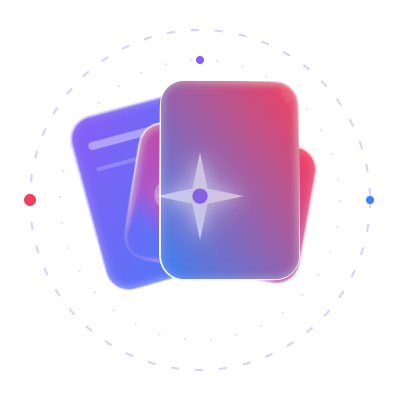
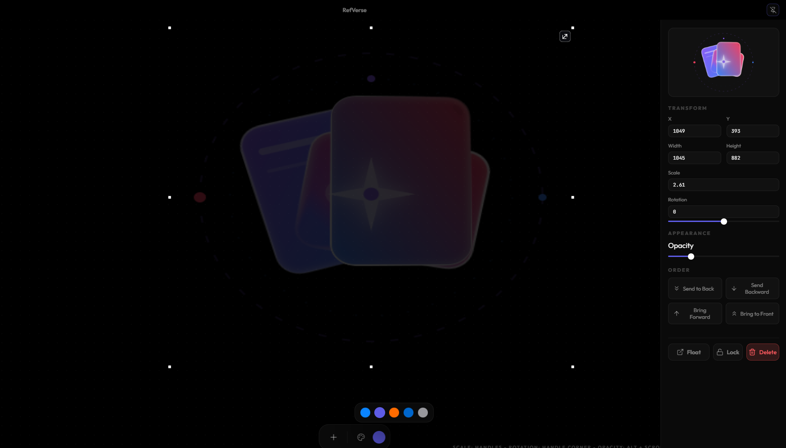
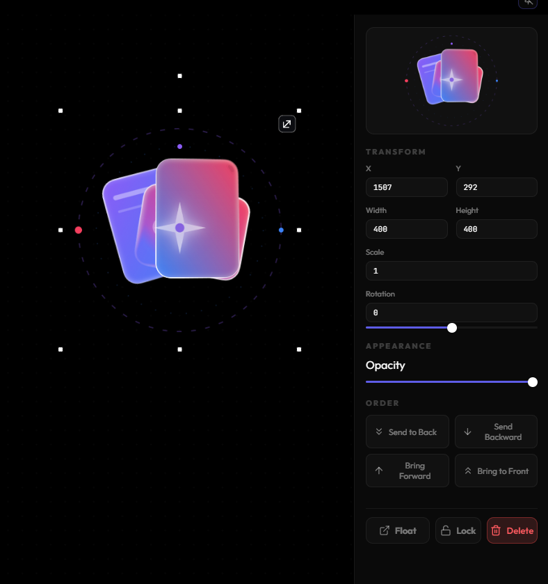
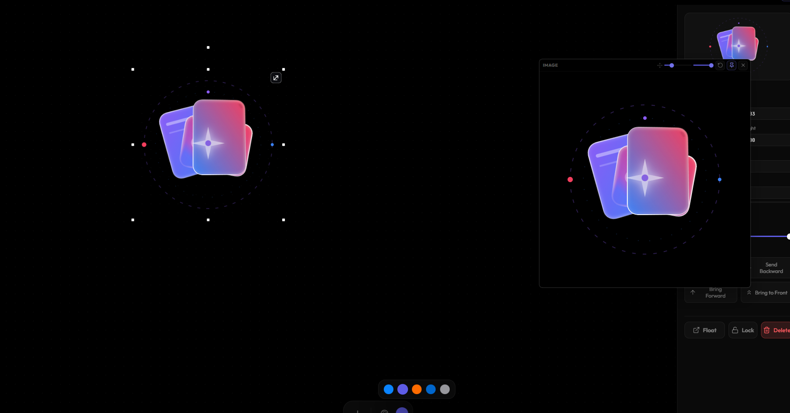
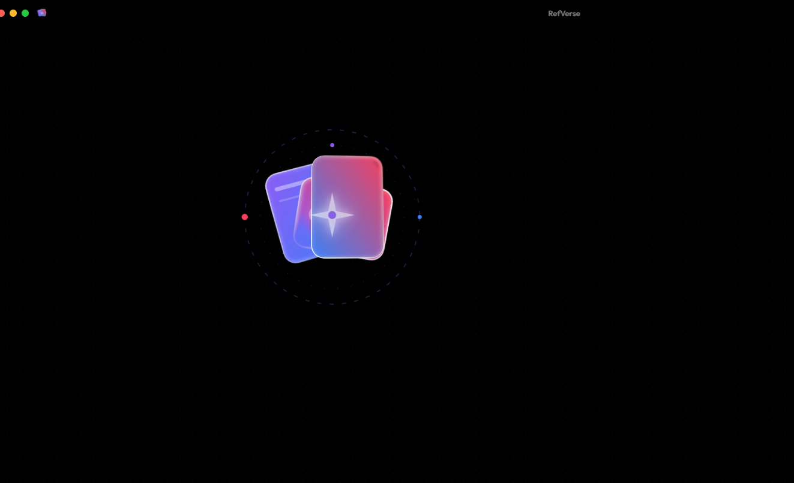

<div align="center">

<br/>



<br/><br/>

# RefVerse

**Infinite reference canvas for designers and artists.**  
Drop images and PDFs. Arrange. Think.

<br/>

<a href="https://github.com/mohgomaa-art/RefVerse/releases/download/0.1.0/RefVerse_0.1.0_x64-setup.exe"></a>

<br/>

<a href="#"></a> <a href="#"></a>

<br/>

</div>

---

<br/>



<br/><br/>

## What it does

Drop any image or PDF onto an infinite canvas. Scale it, rotate it, adjust its opacity, reorder layers. That's it. No accounts, no cloud, no clutter — just your references and your focus.

<br/>

---

<br/>



<br/><br/>

## Features

- **Infinite canvas** — pan and zoom with no limits
- **Drag & drop import** — images (PNG, JPG, WEBP, AVIF, SVG) and PDFs
- **Full transform control** — scale, rotation, opacity, z-order per item
- **Inspector panel** — numeric precision for every property
- **5 built-in themes** — Vision · Midnight · Solaris · Frost · Graphite
- **Frameless window** — minimal chrome, maximum focus
- **Auto-save** — your board persists between sessions, locally

<br/>

---

<br/>



<br/><br/>

## Keyboard shortcuts

| Key | Action |
|---|---|
| `Scroll` | Zoom in / out |
| `Middle drag` | Pan canvas |
| `[ ]` | Send backward / bring forward |
| `Shift + [ ]` | Send to back / bring to front |
| `Alt + Scroll` | Adjust opacity |
| `Delete` | Remove selected |
| `Escape` | Clear selection |
| `Cmd/Ctrl + A` | Select all |
| `F` | Fit all items in view |
| `0` | Reset zoom to 100% |
| `Cmd/Ctrl + Z` | Undo |

<br/>

---

<br/>



<br/><br/>

## Install

No installer needed. Download the `.exe`, run it.

```
RefVerse.exe
```

Windows may show a SmartScreen prompt on first launch — click **More info → Run anyway**. The app is unsigned but safe.

<br/>

---

<br/>

<div align="center">

Built with [Tauri](https://tauri.app) · [React](https://react.dev) · [Konva](https://konvajs.org)

<br/>

<sub>© 2026 RefVerse — MIT License</sub>

</div>
